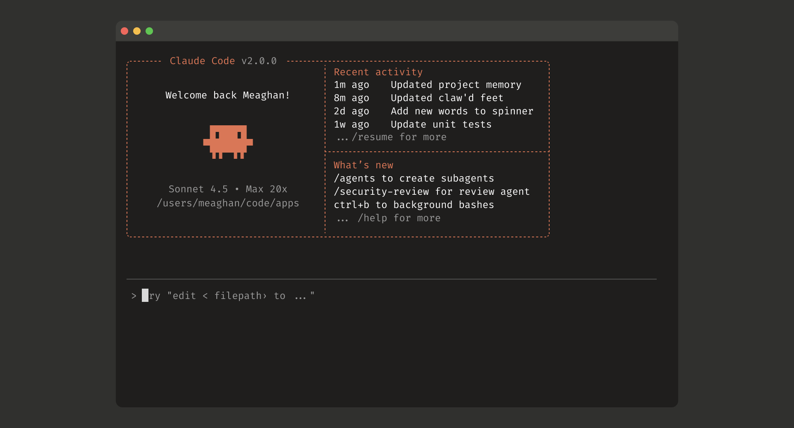

# 초보자를 위한 초보자를 위한 Claude Code 과정

**Claude Code를 활용한 AI 기반 개발을 마스터하기 위한 초보자용 완벽 가이드**

**이 과정은 100% 무료입니다!** 강좌를 보거나 배우는 데 아무런 비용도 지불할 필요가 없습니다.

모든 콘텐츠는 누구나 자유롭게 이용할 수 있습니다.

> **참고:** 이 과정의 내용은 Claude Code 자체의 도움을 받아 작성되었으나, 실제 업무에서 Claude Code를 적극적으로 사용하는 숙련된 파워 유저의 엄격한 지도와 검증 하에 제작되었습니다. 저는 [gitscroll.dev](https://gitscroll.dev), [mcp-framework](https://github.com/koki7o/mcp-framework) 🦀 (AI 에이전트 구축을 위한 Rust MCP 프레임워크), [time-portal.vercel.app](https://time-portal.vercel.app) (과거로 돌아가는 둠 스크롤), [childrenbooks.vercel.app](https://childrenbooks.vercel.app) (동화책) 등 다양한 프로덕션 프로젝트를 개발했으며, 현재 [aicofounders.co](https://aicofounders.co) (6명의 AI 공동창업자)와 [moltplace.net](https://www.moltplace.net) (Moltbot 마켓플레이스)을 모두 Claude Code를 이용해 데일리 개발하고 있습니다.

**이 과정이 도움이 되셨다면, 커피 한 잔을 후원해 주세요!** 여러분의 후원은 더 유익한 콘텐츠를 만드는 데 큰 힘이 됩니다!

---

## Claude Code란 무엇인가요?

**Claude Code는 자연스러운 대화를 통해 코드를 작성하고, 디버깅하며, 개선하도록 도와주는 AI 기반의 커맨드 라인 툴(CLI)이자 페어 프로그래머입니다.**

코드의 모든 줄을 일일이 수동으로 작성하는 대신, 달성하고자 하는 목표를 설명하면 Claude Code가 구현을 도와줍니다. 파일 읽기, 코드 수정, 명령어 실행, 웹 검색 등 다양한 작업을 수행할 수 있으며, 이 모든 과정에서 자신이 어떤 작업을 하고 있는지 설명해 줍니다.

**[Claude Code 시작하기](https://github.com/anthropics/claude-code)**

---

## 이 과정은 누구를 위한 것인가요?

- **완전 초보자** - 프로그래밍이 처음이신가요? Claude Code와 함께 무언가를 만들면서 배울 수 있습니다!
- **경험 있는 개발자** - 작업 워크플로우 속도를 높이고 복잡한 작업도 더 빠르게 처리하세요.
- **학생** - 든든한 AI 튜터와 함께 프로그래밍 개념을 학습하세요.
- **오픈소스 기여자** - 낯선 코드베이스를 쉽게 탐색하고 파악하세요.
- **테크니컬 라이터** - 코드를 이해하고 더 나은 문서를 작성하세요.

---

## 무엇을 배우게 되나요?

이 과정을 마치면 다음을 할 수 있게 됩니다:

- Claude Code를 사용하여 처음부터 애플리케이션 구축
- 코딩 작업을 AI에게 효과적으로 전달
- AI의 도움을 받아 에러 디버깅 및 수정
- 낯선 코드베이스 탐색 및 이해
- 개발 워크플로우에 Claude Code 통합 활용
- 백그라운드 에이전트 및 MCP 서버와 같은 고급 기능 사용
- 버전 관리 및 Git 작업 수행
- Claude Code의 도움을 받아 애플리케이션 배포

---

## 과정 구성

**핵심 모듈 10개 + 심화 모듈 5개 | 자신의 속도에 맞춘 자기주도 학습 | 프로젝트 기반**

---

### [모듈 1: Claude Code에 오신 것을 환영합니다 - 첫 걸음](module-01-welcome-to-claude-code.md)

**목표:** Claude Code에 익숙해지고 무엇을 할 수 있는지 이해하기

**배울 내용:**
- "AI 페어 프로그래밍"이란 무엇이며 왜 혁명적인가
- Claude Code 설치 방법
- CLI(커맨드 라인 인터페이스) 이해하기
- Claude Code와의 첫 대화
- 꼭 알아두어야 할 기본 용어

**실습:** 첫 Claude Code 세션을 실행하고 간단한 프로그램 만들기

---

### [모듈 2: 첫 프로젝트 시작하기](module-02-starting-your-first-project.md)

**목표:** Claude Code를 사용하여 개발을 시작하는 다양한 방법 배우기

**배울 내용:**
- **처음부터 시작하기:** 프로젝트를 설명하고 Claude Code가 뼈대를 잡도록 하기
- **기존 코드로 작업하기:** 기존 프로젝트 구조를 탐색하고 수정하기
- **템플릿 사용하기:** 일반적인 프로젝트 구조로 빠르게 시작하기
- **복제(Clone) 및 코드 이해:** 기존 레포지토리에서 학습하기

**실습:** 각각의 방법을 직접 시도해보고 본인에게 가장 잘 맞는 방법 찾기

---

### [모듈 3: Claude Code의 도구 이해하기](module-03-understanding-tools.md)

**목표:** Claude Code가 가진 다양한 기능 마스터하기

**배울 내용:**

#### 파일 작업
- Read 도구로 파일 시스템 읽기
- Write 도구로 새 파일 작성하기
- Edit 도구로 기존 파일 수정하기
- Glob 도구로 파일 검색하기
- Grep 도구로 코드 검색하기

#### 명령어 실행
- Bash를 사용한 터미널 명령어 실행
- 백그라운드 프로세스
- 장기 실행 작업 관리

#### AI 기능
- 특수 목적 에이전트 사용 (Task 도구)
- 웹 검색 및 정보 가져오기 (Web Fetch)
- 코드 인텔리전스를 위한 LSP (Language Server Protocol) 활용

**실습:** 다양한 시나리오에 맞게 각 도구를 사용하는 연습

---

### [모듈 4: 파일 및 코드 작업하기](module-04-working-with-files.md)

**목표:** 코드를 읽고, 쓰고, 효과적으로 수정하는 방법 배우기

**배울 내용:**
- **코드 읽기:** 기존 코드베이스 이해하기
- **새 코드 작성:** 파일과 함수 생성하기
- **코드 편집하기:** 기존 코드를 망가뜨리지 않고 정확하게 수정하기
- **리팩토링:** 코드 구조 개선하기
- **코드 찾기:** 대규모 코드베이스 탐색하기
- **패턴 이해하기:** 기존 코드를 통해 학습하기

**실습:** 프로젝트를 하나 골라 이런 기술들을 사용해 개선해 보기

---

### [모듈 5: 코딩 작업을 위한 효과적인 프롬프팅](module-05-prompt-engineering.md)

**목표:** AI에게 코딩 작업을 효과적으로 전달하는 기술 마스터하기

**배울 내용:**
- **구체적으로 말하기:** 기술적 요구사항을 명확히 설명하는 방법
- **컨텍스트 제공:** 코딩 작업에서 세부 정보가 왜 중요한가
- **반복적인 개발:** 더 나은 결과를 얻기 위해 요청 다듬기
- **일반적인 프롬프트 패턴:** 코딩에 효과적으로 검증된 템플릿
- **질문하기:** Claude Code가 내 요구사항을 명확히 이해하도록 돕기

**실습:** 다양한 코딩 작업을 위한 효과적 프롬프트 작성 연습

---

### [모듈 6: 백그라운드 에이전트 사용하기](module-06-background-agents.md)

**목표:** 복잡한 작업을 위해 특화된 에이전트 사용법 익히기

**배울 내용:**

#### 에이전트 유형
- **Explore 에이전트:** 코드베이스 탐색 및 이해
- **Plan 에이전트:** 구현 전략 설계
- **General-purpose 에이전트:** 다단계 작업 처리
- **Custom 에이전트:** 특정 문제 해결

#### 에이전트 사용 시점
- 복잡한 다단계 작업
- 코드베이스 탐색
- 리서치 및 조사
- 병렬 작업 실행

**실습:** 에이전트를 사용하여 코드베이스를 탐색하고 기능 기획하기

---

### [모듈 7: Git 작업 및 버전 관리](module-07-git-operations.md)

**목표:** Claude Code로 Git 워크플로우 완전 정복하기

**배울 내용:**
- **커밋 생성:** Claude Code에게 의미 있는 커밋 메시지 작성 맡기기
- **브랜치 작업:** 브랜치 생성 및 관리
- **Pull Request 생성:** PR 설명 자동 생성하기
- **코드 리뷰:** 커밋 전에 변경 사항 파악하기
- **충돌 해결:** AI의 도움으로 병합 충돌 처리하기
- **GitHub 연동:** GitHub CLI(gh) 작업하기

**실습:** 코드 변경부터 PR 생성까지 전체 Git 워크플로우 실습

---

### [모듈 8: 디버깅 및 테스팅](module-08-debugging-and-testing.md)

**목표:** AI의 도움으로 문제를 찾고 고치는 방법 배우기

**배울 내용:**
- **에러 메시지 읽기:** 무엇이 잘못되었는지 이해하기
- **디버깅 전략:** 체계적인 문제 해결 방식
- **테스트 작성:** 단위 및 통합 테스트 작성
- **테스트 주도 개발 (TDD):** 테스트를 먼저 작성하고 코드 작성하기
- **성능 디버깅:** 병목 지점 찾아 해결하기
- **일반적인 디버깅 시나리오:** 실제 문제 해결 사례

**실습:** 고장난 애플리케이션을 오류 수정하고 테스트 추가하기

---

### [모듈 9: 실전 프로젝트 - 완전한 애플리케이션 구축](module-09-real-world-project.md)

**목표:** 배운 모든 것을 적용해 전체 프로젝트 구축하기

**프로젝트 선택:**
- **CLI 툴:** 터미널/커맨드 라인 유틸리티 구축
- **Web API:** 데이터베이스가 연동된 REST API 작성
- **Full-Stack 앱:** 완전한 풀스택 웹 애플리케이션 구축
- **데이터 파이프라인:** 데이터 처리 시스템 만들기
- **자동화 도구:** 워크플로우 자동화 스크립트 작성

**만들 결과물:**
- 완벽한 프로젝트 구조
- 여러 개의 모듈 및 파일 세트
- 테스트 코드 및 문서
- 버전 관리(Git) 히스토리
- 배포되어 정상 작동하는 애플리케이션

**단계별 프로세스:**
1. 애플리케이션 기획
2. 프로젝트 구조 세팅
3. 핵심 기능 구축
4. 점진적인 기능 추가
5. 테스트 및 디버깅
6. 서비스 배포

---

### [모듈 10: 개발 워크플로우 모범 사례](module-10-workflow-best-practices.md)

**목표:** Claude Code를 활용한 전문가급 개발 워크플로우 배우기

**배울 내용:**
- **작업 관리:** TodoWrite 도구의 효과적 활용
- **코드 리뷰:** 커밋 이전 변경 사항 점검하기
- **문서화:** AI를 활용해 명확한 문서 작성하기
- **에러 핸들링:** 견고한 에러 처리 구현
- **로깅 시스템:** 의미 있는 로그 추가하기
- **코드 정리:** 깔끔한 프로젝트 구조 설계

**실습:** 모범 사례를 따르는 기능 개발하기

---

## 심화 모듈 (선택 사항)

*이 모듈들은 핵심 과정을 완료하고 더 깊이 파고들고 싶은 학습자를 위한 내용입니다.*

> **더 많은 정보가 필요하신가요?** 이 무료 과정을 마친 후엔 [**실전 프로젝트 팩**](https://devfounder.gumroad.com/l/claude-code-real-projects) (11가지 실습 프로젝트 템플릿)과 [**심화 모듈 강좌**](https://devfounder.gumroad.com/l/claude-code-advanced-modules) (8가지 엔터프라이즈 레벨 교육 모듈)도 확인해보세요. 아니면 [**컴플릿 번들**](https://devfounder.gumroad.com/l/claude-code-advanced-modules+real-projects-bundle)로 $10 할인된 가격으로 모두 만나볼 수도 있습니다!

---

### [모듈 11: MCP 서버 - Claude Code 확장하기](module-11-mcp-servers.md)

**목표:** 모델 컨텍스트 프로토콜(MCP) 서버를 사용하여 Claude Code에 새로운 기능 부여하기

**배울 내용:**
- **MCP란 무엇인가:** 프로토콜의 이해 및 필요성
- **핵심 MCP 서버:** 실무에서 실제로 중요한 필수 서버 (Context7, Playwright, DeepWiki 등)
- **설치 및 설정:** 프로젝트 레벨의 `.mcp.json` 파일과 전역 사용자 설정
- **일반적인 MCP 서버:** 파일 시스템, 데이터베이스, GitHub 연동 서버
- **나만의 MCP 서버 만들기:** 현재 지원되는 SDK로 맞춤형 확장 서버 구축

**실습:** 필수 MCP 서버 환경을 설정하고 나만의 커스텀 서버 구축해 보기

---

### [모듈 12: Claude Code 커스터마이징 - 나만의 도구로 만들기](module-12-skills-and-hooks.md)

**목표:** Claude Code의 동작을 제어하고 수정하는 모든 방법 완벽 마스터

**배울 내용:**
- **CLAUDE.md & 메모리:** 프로젝트 메모리 파일, 자동 메모리 기록 시스템, `@imports` 지시어
- **규칙(Rules):** 경로 기반으로 적용 범위를 좁히는 모듈식 `.claude/rules/`
- **설정(Settings):** 5계층 계층 구조, 권한 및 모드 관리
- **스킬(Skills):** `.claude/skills/<name>/SKILL.md`를 사용해 커스텀 슬래시 명령어 만들기
- **간단한 명령어(Commands):** 보다 간편한 방식의 `.claude/commands/` 커스텀 방식
- **훅(Hooks):** 자동 코드 포맷팅, 보안 검사, 알림 등을 작동시키는 17가지 자동화 훅 이벤트
- **커스텀 에이전트:** 특정 목적의 에이전트를 관리하는 `.claude/agents/` 디렉토리 도입

**실습:** 프로젝트 메모리 셋업, 스킬 제작 및 커스텀 훅 작성

---

### [모듈 13: 다양한 언어 및 프레임워크로 작업하기](module-13-languages-and-frameworks.md)

**목표:** 여러 기술 스택에서 Claude Code를 자유자재로 다루기

**배울 내용:**
- **Python:** Flask, Django, FastAPI 개발
- **JavaScript/TypeScript:** Node.js, React, Next.js 프로젝트 관리
- **Go:** Go 애플리케이션 작성
- **Rust:** Rust 환경에서 Claude Code 활용하기
- **기타 주요 언어:** Java, Ruby, PHP 등
- **다국어(Polyglot) 프로젝트:** 두 개 이상의 프로그래밍 언어로 이루어진 앱 구축

**실습:** 여러 언어로 간단한 앱 구성해 보기

---

### [모듈 14: API 통합 및 웹 작업](module-14-api-integration.md)

**목표:** 외부 API 접근 및 웹 리소스 다루기 완벽 공략

**배울 내용:**
- **웹 검색:** 해결책이나 레퍼런스 공식 문서 찾기
- **웹 접근 (Web fetch):** API 공식 문서 불러오기
- **API 연동:** 서드파티 서비스와 안전한 연결 작업
- **인증(Auth):** API 키 통신 및 OAuth의 안전한 처리 방식
- **사용량 제한(Rate limiting):** API 할당량 초과 시 대비 전략
- **에러 핸들링:** API 장애나 예기치 않은 응답 대비 모범 사례

**실습:** 여러 서드파티 API를 엮어서 작동하는 프로젝트 구현하기

---

### [모듈 15: 실제 프로덕션 서버로 배포하기](module-15-production-deployment.md)

**목표:** 내가 만든 프로그램들을 사용자들이 사용할 수 있도록 실제 환경에 배포하기

**배울 내용:**
- **컨테이너 기술:** Docker와 Claude Code 연동하기
- **CI/CD 파이프라인:** 자동화된 배포 시스템 세팅
- **모니터링:** 시스템 관찰 및 로그 추가
- **보안(Security):** 코드 작성 시 모범 보안 지침 및 팁
- **성능 최적화:** 어플리케이션 속도를 끌어올리는 관리 포인트
- **확장성 관리(Scaling):** 앱 성장 단계별 서버 처리 노하우

**실습:** 사용자 요구를 충족하는 프로덕션 레벨 서비스 무사히 배포하기

---

## 필수 요건

**필요한 기본 컴퓨터 기술:**
- 터미널이나 커맨드 라인을 사용할 줄 안다 (또는 배울 의지가 있다)
- 영문을 타이핑하거나 소통하는 데 거부감이 덜하다 (Claude의 메뉴 언어)
- 인터넷이 연결된 컴퓨터를 갖고 있다
- 호기심을 갖고 배우고자 하는 열의

**프로그래밍 경험은 필요 없습니다!** 이 과정은 Claude Code 사용법과 함께 점진적으로 프로그래밍 개념을 가르칩니다.

---

## 학습 리소스 모음

### 공식 Claude Code 자료

- **공식 문서:** [Claude Code Docs](https://github.com/anthropics/claude-code)
- **GitHub 레포지토리:** 제품 소스 코드 및 이슈 트래커
- **Claude API 문서:** 백엔드에 쓰이는 메인 API 기반 기술 이해
- **커뮤니티 지원:** 공식 디스코드, 사용자 질문 커뮤니티

### 핵심 공식 문서 목록 (영문 기준)

- Installation Guide
- Getting Started
- Tool Reference
- Configuration Options
- MCP Server Guide

---

## 초보자를 위한 핵심 개념

### "AI 페어 프로그래밍"이란?

> **AI 페어 프로그래밍**은 AI와 함께 나란히 앉아 소프트웨어를 구축하는 것을 의미합니다. 한 줄 한 줄 코드를 혼자 다 타이핑하는 대신 당신이 어떤 코드가 필요한지 AI에게 말해주면, AI가 대신 타자를 치고 구현해 냅니다. 어려운 부분이 있을 때 언제든 도와주는 전문 개발자가 바로 옆 상주하는 것과 비슷합니다.

### CLI (커맨드 라인 인터페이스) 이해하기

Claude Code는 터미널 화면에서 동작합니다. 긴장하실 필요 없습니다! 여러분이 알아야 할 전부를 차근차근 알려 줄 것입니다.

### Claude Code 작동 방식

1. **사용자(나):** 무엇을 구축할지 혹은 수정할지 말로 설명합니다
2. **Claude Code:** 요청을 분석하고 미진한 부분이 있다면 확인 질문을 합니다
3. **AI 어시스턴트:** 도구를 사용해서 파일을 읽고, 코드를 작성하고, 명령어를 실행합니다
4. **사용자(나):** 수정된 내용들을 검토하고 추가 의견을 줍니다
5. **반복:** 원하는 최종 결과물이 도출될 때까지 위 작업을 계속 진행합니다

### 사용 도구(Tools)의 아주 심플한 설명

- **Read** → "이 파일을 읽고 나에게 보여줘"
- **Write** → "이 내용으로 새 파일을 만들어줘"
- **Edit** → "이 특정 위치(코드)를 바꿔줘"
- **Bash** → "터미널에서 이 명령을 실행해"
- **Task** → "이 복잡하고 여러 단계의 작업을 알아서 해결해"
- **Grep** → "코드 내에서 특정 단어나 형태를 모두 검색해"

---

## 과정 이수 후 결과

이 과정을 무사히 통과한다면, 다음의 능력이 계발됩니다:

- 자신감을 가지고 실제 코딩 작업에 Claude Code를 능숙하게 다룬다.
- AI 코딩 에이전트와 효과적으로 소통하고 지시하는 방법을 완벽히 이해한다.
- AI 도우미와 함께 세상에 없던 자신만의 애플리케이션을 만들 수 있다.
- 에러를 디버깅하고 코드를 가장 빠르고 효과적으로 테스트하는 법을 숙지한다.
- 최소한 내 손으로 코드를 짜고 실제 세상(인터넷)에 앱을 최소 하나 서비스해봤다.
- Git을 이용한 소스 코드(버전) 관리를 프로처럼 해낸다.
- 취업이나 자랑을 위해 내 포트폴리오를 멋지게 장식할 수 있다.

---

## 시작하기

**여정을 시작할 준비가 되셨나요?**

1. **[Claude Code 설치하기](https://github.com/anthropics/claude-code):** 설치 가이드를 참조하세요
2. **첫 세션 실행:** 컴퓨터 터미널에서 `claude`를 실행합니다
3. **[모듈 1 과정 진행하기](module-01-welcome-to-claude-code.md):** 가장 중요한 첫 발판입니다

---

## 이 과정의 특징

- **자기주도 페이스:** 자신의 일상 속도에 맞춰 배울 수 있습니다.
- **프로젝트 실습 기반:** 모든 모듈은 눈에 보이는 실습 예제를 포함합니다.
- **점진적 레벨 업:** 각 단계는 전 단계를 클리어해야 이해되는 성장의 구조입니다.
- **유연한 진행 단계:** 이미 아는 쉬운 내용은 패스! 어려운 내용엔 집중! 내가 결정합니다.

---

## 모듈 챌린지

**단계적으로 조금씩 어려워지는 챌린지로 학습한 내용을 실습하고 자기 것으로 만드세요!**

각 모듈마다 조금씩 어려워지는 직접 해볼 수 있는 실습 챌린지가 포함되어 있습니다:
- **초급 챌린지** - 모듈에서 배운 핵심 내용과 하나의 태스크 해결
- **중급 챌린지** - 여러 개념의 조합과 다단계 멀티 태스킹 해내기
- **고급 챌린지** - 복잡한 기능 구현과 모범 방법론적 개발 도입
- **전문가 챌린지** - 프로덕션 수준의 실제 레벨 제품 구축하기

**[챌린지 정답 및 해설](supplement-challenge-solutions.md)** - 스스로 평가하기 위한 추천 정답과 힌트 수록

**팁:** 정답이나 해설을 먼저 보지 말고 먼저 자신만의 방법으로 부딪혀 본 후, 비교하며 접근성을 느껴보세요!

---

## 도움이 필요하신가요?

- **[공식 문서](https://github.com/anthropics/claude-code):** 상세 메뉴얼 및 사용법이 있습니다.
- **[문제 해결 (트러블슈팅)](supplement-troubleshooting.md):** 자주 보이는 오류와 해결책
- **[빠른 참고 가이드](supplement-quick-reference.md):** 언제라도 빨리 펴보는 커닝 페이퍼
- **[GitHub 이슈 메뉴](https://github.com/anthropics/claude-code/issues):** 알려지지 않은 새로운 버그 제보나 기능 건의

---

## 과정을 완수했다면, 다음은?

이 과정을 성공적으로 마쳤다면, 더 멀리 나아갈 수 있습니다:

- 구상해두었던 자신만의 멋진 앱과 도구들 구축해보기
- 이름있는 세상의 수많은 오픈소스 프로젝트에 당당히 기여해보기
- 심화된 AI 개발 방법론 활용하기
- 프로페셔널한 실제 업무의 팀 시스템 개발에 Claude Code 채택하기
- 자신만의 독창적인 MCP 기기나 스킬 조합을 확장 구축하기
- 비슷한 초보자들에게 내가 체득한 엄청난 이 마법을 알려주기

---

## 🚀 전문가 수준으로 스킬 폭발시키기 (프리미엄 과정)

**초보 개발자에서 전문가로 바로 직행하고 싶으신가요?** 더 깊은 저희의 프리미엄 리소스로 여정을 발전시키세요:

### 📦 [실전 프로젝트 팩 - $39.99](https://devfounder.gumroad.com/l/claude-code-real-projects)

**11가지 완전한 프로젝트 템플릿과 세부적인 Claude Code 단계별 워크플로우:**

- AI 구동 Todo 앱 (Claude API 연결)
- 코드 자동 리뷰 툴
- 문서 정보 제너레이터
- 버그 파인더 자동 어시스턴트
- 무한 테스트 코드 제너레이터
- 나만의 API 클라이언트 빌더
- 완벽한 앱 DB 스키마 디자이너
- 완벽한 기초 CLI 환경 스타터 킷
- 마이크로서비스 빌드 템플릿
- 풀스택 SaaS 보일러플레이트 앱 (가입, 결제-Stripe, 멀티 테넌트 등)
- **NEW:** 커스텀 퍼펙트 환경 (스킬, 에이전트, 훅, 퍼미션 등을 망라한 나만의 완벽한 `.claude/` 규칙 구성하기)

*모든 각 프로젝트는 실전 프로덕션 소스 샘플, 통째로 써먹을 수 있는 프롬프트 모음 및 3~5시간 이상의 분량을 갖추고 있습니다.*

---

### 🎓 [심화/고급 모듈 - $29.99](https://devfounder.gumroad.com/l/claude-code-advanced)

**전문 개발자를 위해 준비된 8가지 엔터프라이즈 레벨 깊이의 교육 모듈:**

- **모듈 16:** 스케일링 프로덕션 배포 (쿠버네티스 생태계, 오토 스케일링, 멀티 리전 대응)
- **모듈 17:** 멀티 에이전트 시스템 협업 (복잡한 AI 파이프라인 워크플로우, 에이전트 역할 지휘)
- **모듈 18:** 나만의 커스텀 MCP 서버 구축 (단순 장난감 수준이 아닌 상용 등급 연결 서버 구축)
- **모듈 19:** 엔터프라이즈 통합 연결 (SSO 연동, 역할 권한 제어, 민첩한 로깅 감사 등)
- **모듈 20:** 비용 절감 및 개발 최적화 (토큰 절약 최적화 기법, 응답 캐싱 등 상용 앱 효율성)
- **NEW 모듈 21:** 커스텀 에이전트와 지휘 통제 기법 시스템 구축 (프론트매터, 메모리 관리 규칙, 명렁어→에이전트→스킬 연계 아키텍처)
- **NEW 모듈 22:** 샌드박스, 플러그인 생태계와 고급 권한 셋업 옵션 (허가 시스템 와일드카드, CLI 플래그 세팅 등)
- **NEW 모듈 23:** 프로를 위한 실전 개발 방법론 (RPI 방법론 시스템, 토큰 사용 다이어트, Monorepo 적용 사례 등 적용 기법)

*각각의 8개 모든 모듈은 실전에서 검증된 상용 코드 예제, 최선의 방법론 베스트 프랙티스들로 구성된 고급 난이도의 과정입니다.*

---

### 🔥 [전체 통합 번들 팩 - $59.99 ($10 절약!)](https://devfounder.gumroad.com/l/claude-code-advanced-modules-real-projects-bundle)

**전부 포함: 8 고급 모듈 시스템 + 11가지 실전 적용 리얼 프로젝트 모음**

- ✅ **55시간 이상 분량**의 깊이 있는 압도적 지식 패키지
- ✅ 이론과 실전 응용을 넘나드는 촘촘한 **19가지 모듈 구성 챕터**
- ✅ 당장 상용으로 내다 팔 수 있는 **프로덕션 등급 레벨의 실전 투입 용 소스코드**
- ✅ 머리 아플 일 없이 복사만 하면 되는 **치트키 적용 급 AI 프롬프트 템플릿 모음**
- ✅ 낱개로 구매할 때 대비 **$10 비용 절약 달성**

**이런 사람들에게 최적격입니다:** 기업 앱 시스템을 이끌거나 구축하는 개발자, 나의 용역 서비스를 훨씬 더 빠르게 무한대로 늘리고 싶은 프리랜서, Claude Code 그 자체의 세계 끝까지 능력을 마스터하고 싶은 모든 열정적인 사람들.

---

## 추가 학습 방향 추천

### 개발자 지망 취준생 권장
- 간단한 자동화 CLI 프로그램 구축해보기
- 기초적인 웹 동작 원리를 다루는 작은 웹앱
- 컴퓨터 프로그래밍 언어의 기초 다지기
- 눈에 보이지 않게 작동하는 소프트웨어 동작 구조 아키텍처 이론

### 숙련된 프로 개발자 권장
- 나의 소중한 워크플로우를 대폭 앞당기는 자동화 시스템 셋업 구축 집중
- 너무나 커서 무섭고 길을 모르는 프로젝트 코드 구조 한 눈에 빠르게 관통 파악하기
- 반복적이고 짜증 나는 노동성 코드 업무 로봇화시키기
- 상상했던 아이디어, 주말 하루만에 빛의 속도로 초벌 빌드하여 실험하고 박살내보기

### 학생 권장
- AI를 똘똘한 튜터로 곁에 두고 하나하나 코딩 프로그래밍 세계관 확립해 나가기
- 과제나 팀 프로젝트 기동성 있게 멋지게 마무리
- 헷갈리는 알고리즘 과제 구조 개념을 시각적으로 뚫어지게 이해하기
- 내가 짠 숙제 오류들 빠르고 날카롭게 진단/해결 받아보기

---

## 꼭 기억하세요

**세상을 놀라게 할 훌륭한 앱을 만들어 내기 위해, 반드시 당신이 완벽한 천재 전문가일 필요는 없습니다!**

Claude Code는 그 누구라도 훌륭한 소프트웨어를 만들어 낼 수 있는 시대의 권리를 부여합니다. 맨 처음 까만 터미널 화면에 당신이 타자를 치게 되는 그 순간부터, 마침내 앱이 세상 사람들 스마트폰에 출시 배포되는 날까지 모든 발걸음을 안내할 것입니다.

**자, 이제 여러분만의 놀라운 앱을 함께 구축을 시작합시다!**

---

*최종 업데이트: 2026년 2월*

